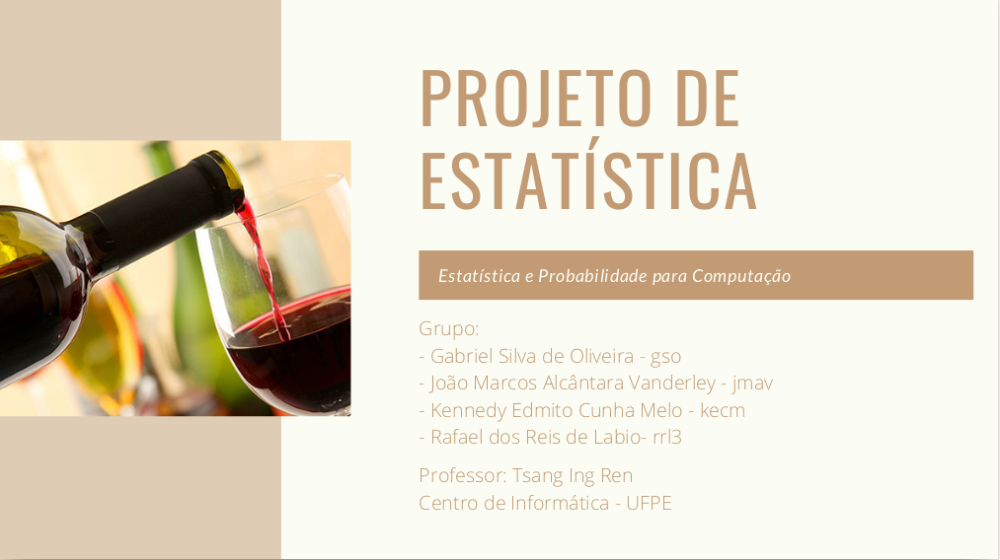
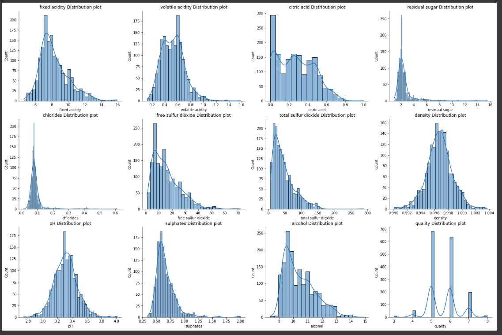
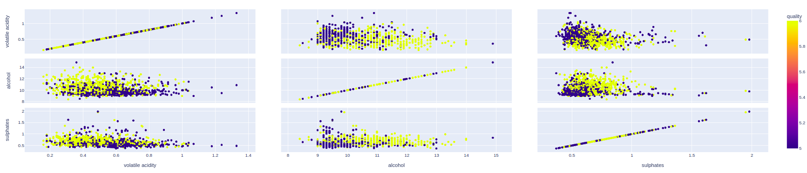
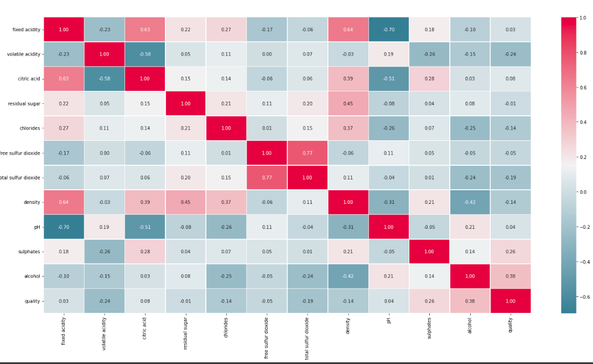
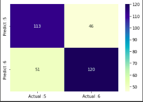

# naive-bayes-classifier

 Exploratory analysis and development of a naive Bayes model to identify the quality of a red wine from its physical and chemical characteristics. 

 All the project was explained in the Project_Report.pdf 

